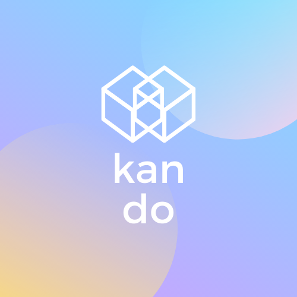

 
  

&#xa0;

  <!-- <a href="https://kando.netlify.app">Demo</a> -->

<h1 align="center">Kan Do</h1>

  

  

  

  

  

  

  

<!-- Status -->

<h4 align="center">
	🚧  Kan Do 🚀 Under construction...  🚧
</h4>

  <a href="#dart-about">About</a> &#xa0; | &#xa0; 
  <a href="#sparkles-features">Features</a> &#xa0; | &#xa0;
  <a href="#rocket-technologies">Technologies</a> &#xa0; | &#xa0;
  <a href="#white_check_mark-requirements">Requirements</a> &#xa0; | &#xa0;
  <a href="#checkered_flag-starting">Starting</a> &#xa0; | &#xa0;
  <a href="#memo-license">License</a> &#xa0; | &#xa0;
  <a href="https://github.com/briceduke" target="_blank">Author</a>

 

## :dart: About

Describe your project

## :sparkles: Features

- [ ] Draggable Kanban board
- [ ] Multiple boards per user
- [ ] Sync data via social login
- [ ] Mobile client
- [ ] Desktop client

## :rocket: Technologies

The following tools were used in this project:

- [NestJS](https://nestjs.com)
- [Next.js](https://nextjs.org)
- [TypeScript](https://www.typescriptlang.org/)
  <!-- - [Expo](https://expo.io/) -->

## :white_check_mark: Requirements

Before starting :checkered_flag:, you need to have [Git](https://git-scm.com) and [Node](https://nodejs.org/en/) installed.

## :memo: License

This project is under license from MIT. For more details, see the [LICENSE](LICENSE) file.

Made with :heart: by <a href="https://github.com/briceduke" target="_blank">Brice Duke</a>

&#xa0;

<a href="#top">Back to top</a>
